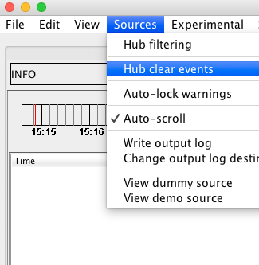

Configuration for Logging Hub to run as an event blotter
========================================================

You can configure LoggingHub to help with a lot of different types of problem - it works well dealing with streaming data but also works well when interacting with a fixed set of data. Until we can come up with a better phrase we'll call this "blotter mode".

Blotter Mode
------------

The general use case for this pattern is that you've got a process that generates a particular number of events - be they orders, or prices, or anything really - and sends them to the hub. The hub then transmits them to the frontends as usual, where the end user can then use LoggingHub's flexible pattern matching filters to quickly isolate specific events from the collection.

Keeping things in sync
----------------------

This mode requires a bit more state management that usual. All of the connected users need a consistent view of the data, so we've added some additional features to help keep things up to date.

Clearing events
---------------

One of the new features allows one frontend to broadcast its "Clear Events" message to everyone connected to the hub. This can be used in the following sequence to get everyone back onto a level playing field:

1. User A connects their frontend
1. Loader process pulls events from their source and sends them to the hub
1. Hub distributes events to users
1. User B connects their frontend - all of the events have been loaded so their frontend is empty
1. The administrator broadcasts the Clear Events message, clearing all events in the system
1. The administrator re-runs the Loader Process and re-sends all events
1. Both User A and User B now have a consistent set of events

### Configuration

This feature is distruptive for other types of Logging Hub deployment, so it is turned off by default. You need to enable it on both the Hub and on the Administrator's Client.

Hub configuration - you need to set *allowClearEvents=true* on the socketHub element:

     <container>

         <socketHub port="15000" allowClearEvents="true"/>

     </container>

Frontend configuration - you need to set

    <loggingFrontendConfiguration title="Example Configuration" showHubClearEvents="true">

        <environment name="local">
            <hub name="local" host="localhost:15000"/>
        </environment>

    </loggingFrontendConfiguration>

With those two settings you should get an options in the Frontend:

Ensuring enough buffer space for your events
--------------------------------------------

In Blotter mode you are likely to want to work with a particular data set of events. This set should have a more predicatable size when compared to the more traditional streaming event mode, so the default Logging Hub Frontend strategy of throwing away the oldest events to keep below a memory threshold isn't so useful.  We've added a new setting in the frontend that allows much more precise control over the amount of event memory available to each enviroment.

     <loggingFrontendConfiguration title="Example Configuration">

         <environment name="local" eventMemoryMB="500">
             <hub name="local" host="localhost:15000"/>
         </environment>

     </loggingFrontendConfiguration>

This will ensure you have a dedicated 500 megabytes of heap for the local environment. It is up to you to ensure that your JVM has enough heap available to it though - you can tweak this by editing the frontend launch scripts.  There are three files in the default deployable archive:

* frontend.bat (Windows)
* frontend.sh (Unix/Linux)
* frontend.command (Mac)

They all do pretty much the same thing - invoke the java runtime with the frontend main class:

    java -cp logginghub-frontend-1.4.11.jar com.logginghub.logging.frontend.SwingFrontEnd

The default heap size (how much memory is available inside the JVM) is quite complex depends on your java version and how much phyiscal RAM you have. It can be as low as 64MB and as high as one quarter of your phyical RAM.  Thankfully we can control it exactly by altering the launcher script as follows:

    java -Xmx1024M -cp logginghub-frontend-1.4.11.jar com.logginghub.logging.frontend.SwingFrontEnd

This would start the JVM with 1 GB of heap, and combined with our frontend configuration would leave a very generous 500MB of heap once the event buffer was full.